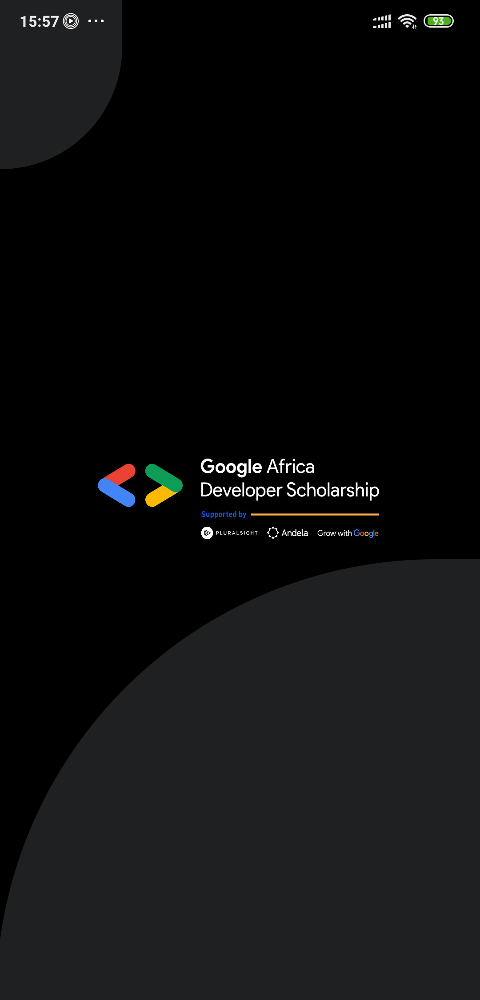
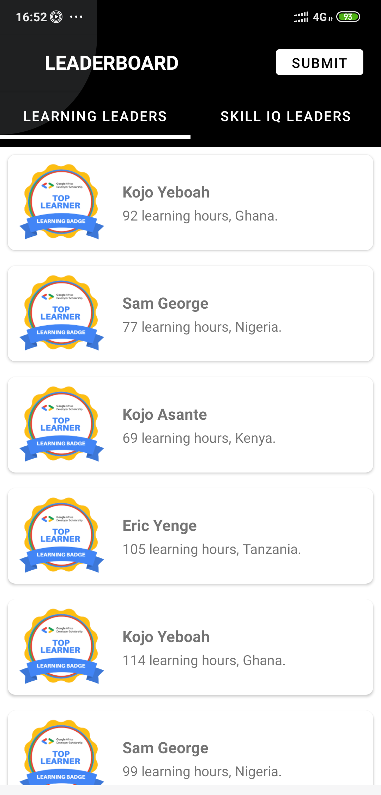
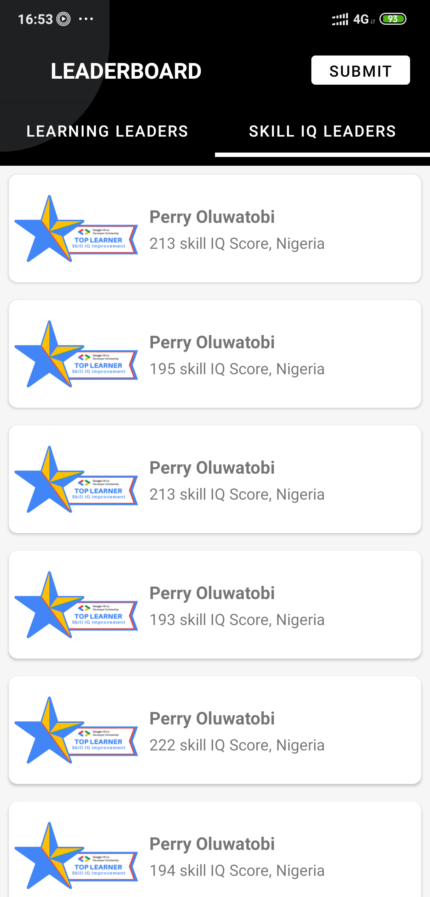
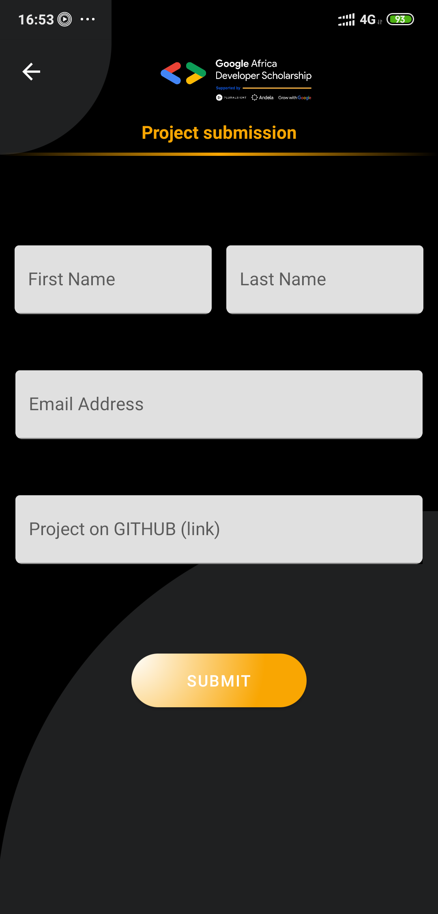
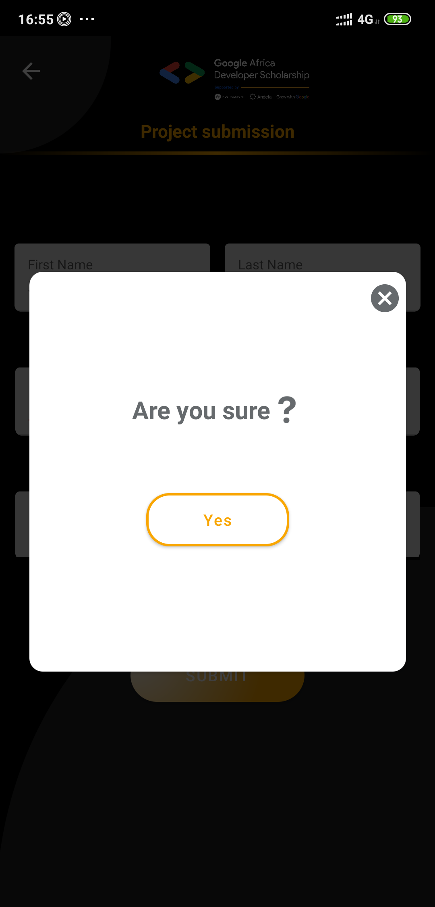
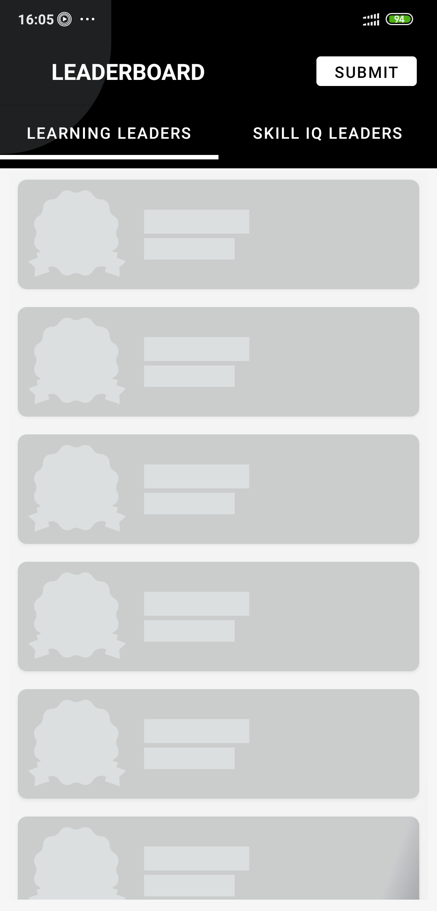
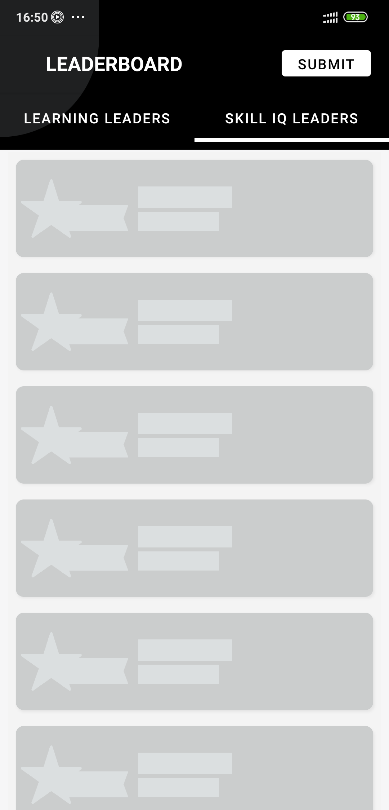
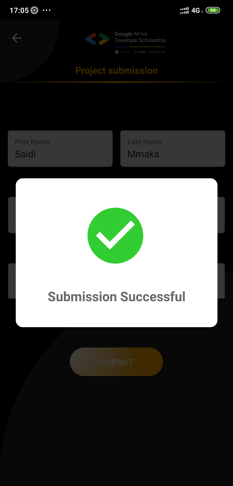
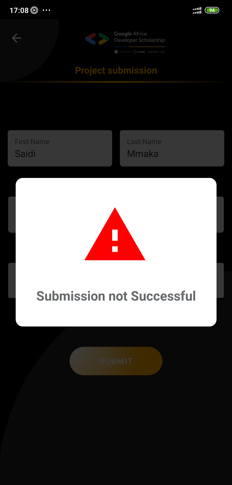

# GADS-Leaderboard
GADS Leaderboard App is an application that displays Top 20 learners in the Learning Leaders’ category and Top 20 learners in the Skill IQ Leaders’ category.

### App Screenshots

<table>
  <tr>
    <td>Splash Screen Page</td>
    <td>Learning Leaders</td>
    <td>Skill IQ Leaders</td>
    <td>Project Submit</td>
  </tr>
  <tr>
    <td></td>
    <td></td>
    <td></td>
    <td></td>
  </tr>
</table>

<table>
  <tr>
    <td>Confirm Dialog</td>
    <td>Learning Leaders Placeholder</td>
    <td>Skill IQ Leaders Placeholder</td>
    <td>Successful Dialog</td>
  </tr>
  <tr>
    <td></td>
    <td></td>
    <td></td>
    <td></td>
  </tr>
</table>

<table>
  <tr>
    <td>Failure Dialog</td>
  </tr>
  <tr>
    <td></td>
  </tr>
</table>
